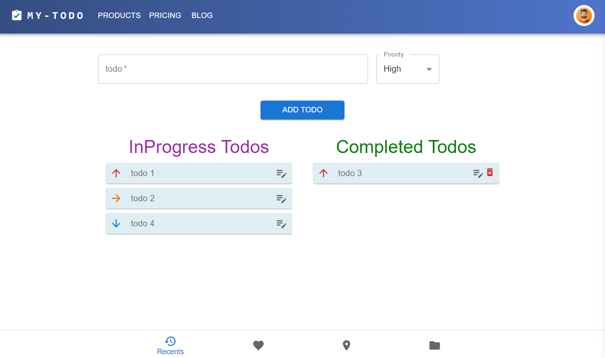

# To-Do App with TypeScript

## Description

Project aims to create a To-Do App with TypeScript.

## Expected Outcome

## Objective

Build a TodoApp with Typescript using Vite+ReactJS.

### At the end of the project, following topics are to be covered;

- MUI
- TS
- Vite + React JS

## Live

<a href="https://wfvsxj-5173.csb.app" target="_blank">MY TODO</a>

## How do we create mockApi? Watch the video!

<a href="https://www.youtube.com/watch?v=i_Gvlp83GMk" target="_blank">
 Watch the video
</a> 
 

Or you can find **MockApi quick start guide** <a href="https://github.com/mockapi-io/docs/wiki/Quick-start-guide" target="_blank">here</a>

**
&#9786; Happy Coding &#9997;
**

## Useful Links
- [Adding typescript](https://create-react-app.dev/docs/adding-typescript/)

- [Other ready template npm commands](https://www.npmjs.com/search?q=cra%20--)

- [Typescript Tutorials](https://www.totaltypescript.com/tutorials)

- [React Typescript Cheatsheets](https://react-typescript-cheatsheet.netlify.app/)

- [Custom hooks written in TypeScript](https://usehooks-ts.com/introduction)
